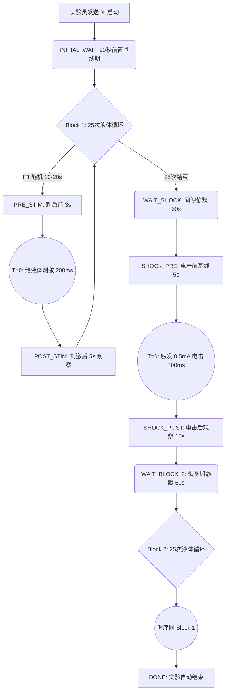

# 路线 B 终极实验指导手册：CSDS 单日单液体扰动区块设计 (Single-Liquid Block Paradigm)

**定稿日期**：2026-03-26  
**审查员状态**：APPROVED (完全符合现代多模态行为神经科学最高标准的严格自身对照设计)

---

## 1. 整体研究规划与实验时间线 (Experimental Timeline)

为了消除“饮水饱胀感 (Satiety)”和“感觉对比效应 (Sensory Contrast)”造成的误差，我们将 3 种刺激拆分到 3 天独立测试，并在 CSDS 造模前后各执行一轮。

### 阶段 1：环境适应与基线测定 (Pre-CSDS)
*   **Day -7 到 -4：节水期与搬运脱敏**。每天将小鼠放入实验台适应一个session的时间，偶尔手动给予微量水，消除环境新异性导致的僵直（Freezing）。
*   **Day -3 (Test 1：水源基线测试)**：测量绝对口渴基线。进行 `[水 Block 1] -> Shock -> [水 Block 2]` Session。
*   **Day -2 (Test 2：糖水奖励测试)**：测量核心奖赏感与快感基线。进行 `[糖水 Block 1] -> Shock -> [糖水 Block 2]` Session。
*   **Day -1 (Test 3：奎宁厌恶测试)**：测量天然厌恶感基线。进行 `[奎宁 Block 1] -> Shock -> [奎宁 Block 2]` Session。

### 阶段 2：慢性社会击败应激造模 (CSDS Induction)
*   **Day 1 到 Day 10**：10 天标准 CSDS 流程 (10分钟物理打击 + 24小时感官暴露)。
*   **Day 11 (SI Test)**：社会交互测试筛选，将小鼠分为 **Susceptible (易感组)** 和 **Resilient (韧性组)**。

### 阶段 3：造模后表型重测 (Post-CSDS)
*   **Day 12, 13, 14**：严格重复阶段 1 的水、糖水、奎宁三日双区块测试。

---

## 2. 单个 Session 内部时序解构图 (Session Flowchart)
在每一天的测试中，小鼠将经历一个极其严密的自动化时序序列。我们以给刺激的瞬间作为 $T=0$ 的绝对锚点（便于 Python 切片）：

### 这种极严时间轴设计的科学优越性：
1.  **明确的 T=0 时间窗**：所有分析都可以基于 `STIMULUS_START` 这句打印，向前截 -3s，向后截 +5s，精准提取出一个 8 秒的 Trial。
2.  **极度纯净的电击区组**：电击前后被长达 60s 的静默间隔期包裹。你能完美捕捉到小鼠从“期待液滴”跌入“急性应激”的纯粹行为崩塌，并且保证了电击的 T=0 前后各有干净的 5s 和 15s 切片。

---

## 3. 硬件与连线清单 (极简且无污染)
由于是路线 B (单液体 Block)，你**不再需要复杂的四通汇流排**。
*   **液体连线**：将你要测试的液体（比如今天的糖水），连接到一个电磁阀（比如接在 `Pin 30` `VALVE_WATER` 接口即可，代码里我合并为单一液体控制器）。电磁阀的另一头连接那根金属水嘴。
*   **传感器**：Touch Sensor 挂在 `A1`。
*   **电击器**：恒流刺激器 TTL 触发接在 `Pin 50`。
*   **同步与标定**：TDT 脉冲输入 `Pin 40`，LED `Pin 7`。    
*   **舔舐同步闪烁**：LED `Pin 44`。

---

## 4. 软件控制功能清单 (Arduino v4.0)
*   **`s`**：启动自动化实验（Start Session）。
*   **`e`**：紧急停止实验（End）。
*   **`f`**：冲洗模式（Flush），彻底打开电磁阀用于排空或换液。
*   **`n`**：恢复正常舔水（Normal Lick）。
*   **`m`**：手动给液（Manual Drop）。触发单独一次液滴，记录时间戳。
*   **`k`**：手动电击（Manual Shock）。触发单独一次 500ms 电击，记录时间戳。

